## 1. Ciencia de datos y metodología para análisis del clima {.cover-slide}

::: {.cover-kicker}
Taller práctico
:::

::: {.cover-title}
De archivos climáticos a patrones interpretables
:::

::: {.cover-subtitle}
EPW · EMA · Weather Data · Climate Consultant · Python/Jupyter
:::

::: {.cover-tags}
::: {.cover-tag}
descarga
:::
::: {.cover-tag}
visualización
:::
::: {.cover-tag}
análisis
:::
:::

## 2. Material para trabajar durante el taller

::: {.grid-2}
:::{}
Material disponible:

- [dist/taller-clima-asistentes.zip](dist/taller-clima-asistentes.zip)
- EPW de Cuernavaca
- CSV de EMA IMTA
- Libreta Jupyter para análisis guiado
- Ejemplo EnerHabitat con materiales
- Gráficas de referencia
- Weather Data: <https://drajmarsh.bitbucket.io/weather-data.html>
- Climate Consultant: <https://www.sbse.org/resources/climate-consultant>

Requisitos:

- Climate Consultant instalado
- Python + Jupyter
- Conocimientos básicos de Python

::: {.callout}
**Propósito**

El paquete permite seguir el análisis sin descargar el repositorio completo.
:::
:::

:::{.img-frame .lift-img}
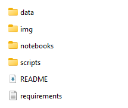
:::
:::

## 3. Del dato climático a la pregunta

::: {.grid-2}
:::{}
Antes de abrir software, definimos el problema:

- **Tiempo meteorológico:** lo que ocurre en un momento específico
- **Clima:** patrones, rangos y extremos de un sitio
- **Dato climático:** evidencia para revisar esos patrones

::: {.callout}
Entender clima es identificar cuándo, cuánto y con qué frecuencia ocurren condiciones críticas.
:::
:::

:::{.img-frame}
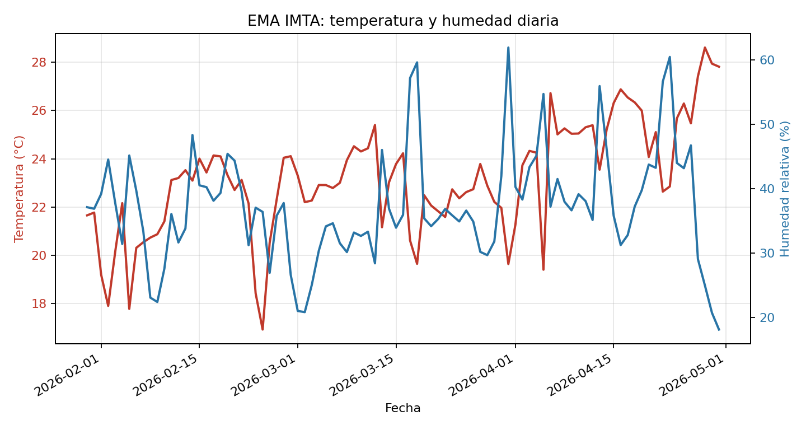
:::
:::

## 4. Por qué los datos ayudan

::: {.grid-2}
:::{}
Los datos permiten pasar de percepción a lectura técnica:

- **Temperatura:** ¿cuándo ocurren máximos y mínimos?
- **Humedad:** ¿sube durante la noche?
- **Radiación:** ¿cuándo hay mayor disponibilidad solar?
- **Viento:** ¿hay dirección o magnitud dominante?

::: {.callout}
Una gráfica sin contexto no basta: se revisan fuente, periodo, unidades y resolución temporal.
:::
:::

:::{.tile}
**Cómo leer una gráfica climática**

- Revisar fuente, periodo y unidades
- Ubicar máximos, mínimos y rangos
- Comparar día/noche y temporada
- Preguntar si el patrón afecta confort, energía u operación
- Convertir la observación en una decisión de análisis
:::
:::
## 5. Tipos de datos climáticos

::: {.grid-2}
:::{.compact}
:::{.tile}
**EMA**

- Datos medidos
- Periodo específico
- Alta resolución temporal
- Requiere revisar huecos y unidades
:::

:::{.tile}
**EPW**

- Archivo climático anual
- 8760 registros horarios
- Útil para software energético
- Representa un perfil típico o histórico
:::
:::

:::{.img-frame .wide-img}
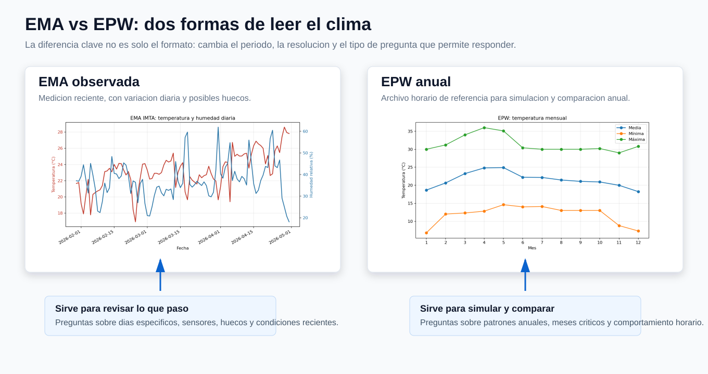
:::
:::

::: {.callout}
La EMA muestra una ventana medida, con huecos y variación reciente; el EPW sintetiza un año horario de referencia para simulación y comparación.
:::

## 6. Fuente EMA: portal de CONAGUA

::: {.grid-2}
:::{.img-frame}
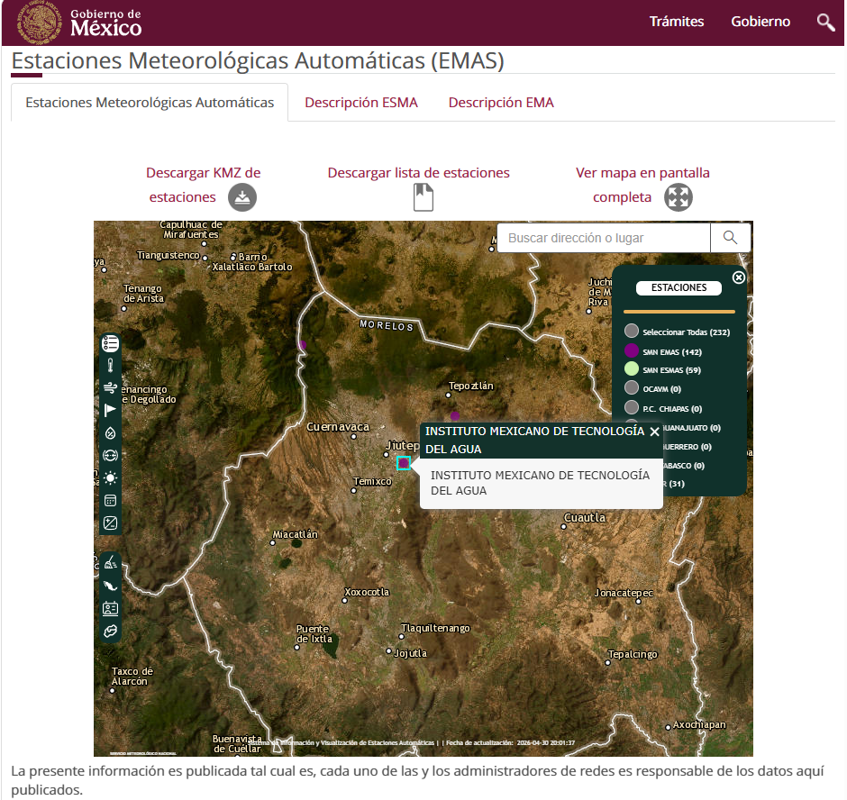
:::

:::{}
Ejemplo del taller:

- Estación: Instituto Mexicano de Tecnología del Agua
- Estado: Morelos
- Municipio: Jiutepec
- Descarga usada: 90 días
- Archivo: <span class="file">data/emas/*.csv</span>
- Sitio: <https://smn.conagua.gob.mx/es/observando-el-tiempo/estaciones-meteorologicas-automaticas-ema-s>
:::
:::

## 7. Descarga EMA: seleccionar periodo

::: {.grid-2}
:::{.img-frame}
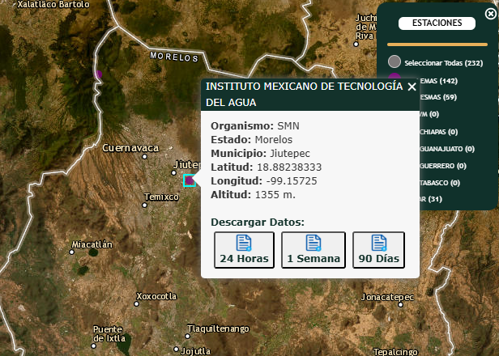
:::

:::{}
Antes de graficar:

- Confirmar estación
- Confirmar coordenadas
- Revisar periodo disponible
- Descargar CSV
- Guardar sin cambiar el nombre de columnas
:::
:::

## 8. Descargar EPW en OneBuilding

::: {.grid-2}
:::{}
Proceso:

1. Entrar a Climate.OneBuilding
2. Ir a WMO Region 4
3. Seleccionar `MEX_Mexico`
4. Buscar `MOR_Morelos`
5. Descargar el ZIP de Cuernavaca

Enlaces útiles:

- <https://climate.onebuilding.org/>
- <https://climate.onebuilding.org/WMO_Region_4_North_and_Central_America/MEX_Mexico/index.html>
- <https://energyplus.net/weather>
- <https://www.ladybug.tools/epwmap/>
:::

:::{.img-frame}
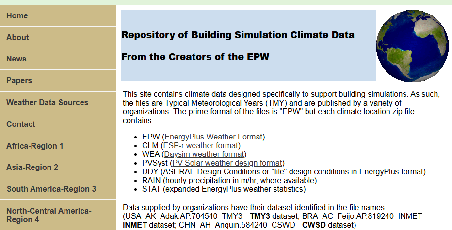
:::
:::

## 9. OneBuilding: México y Morelos

::: {.grid-2}
:::{}
Ruta dentro del sitio:

- `North-Central America - Region 4`
- `MEX_Mexico`
- `MOR_Morelos`
- `Cuernavaca-Matamoros.Intl.AP`

::: {.img-frame}

:::
:::

:::{}
::: {.img-frame}
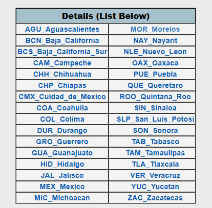
:::

::: {.img-frame}
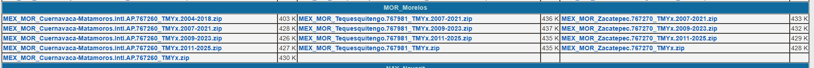
:::
:::
:::

## 10. Fuente EPW: archivo climático anual

::: {.grid-2}
:::{}
Archivo usado:

<span class="file">MEX_MOR_Cuernavaca-Matamoros.Intl.AP.767260_TMYx.epw</span>

Características:

- Sitio: Cuernavaca-Matamoros Intl. AP
- 8760 registros horarios
- Periodo TMYx construido con datos 1980-2025
- Variables: temperatura, humedad, radiación y viento
:::

```text
LOCATION,Cuernavaca-Matamoros.Intl.AP,MOR,MEX,...
DATA PERIODS,1,1,Data,Sunday,1/ 1,12/31
1994,1,1,1,0,...,15.40,8.70,64,...,322,0,0,...
```
:::

## 11. Weather Data: demostración en vivo

::: {.grid-2}
:::{}
Uso durante el taller:

1. Abrir Weather Data
2. Cargar el EPW
3. Revisar temperatura
4. Cambiar variable y escala
5. Identificar visualmente un periodo crítico

Enlace: <https://drajmarsh.bitbucket.io/weather-data.html>

:::

:::{.img-frame}
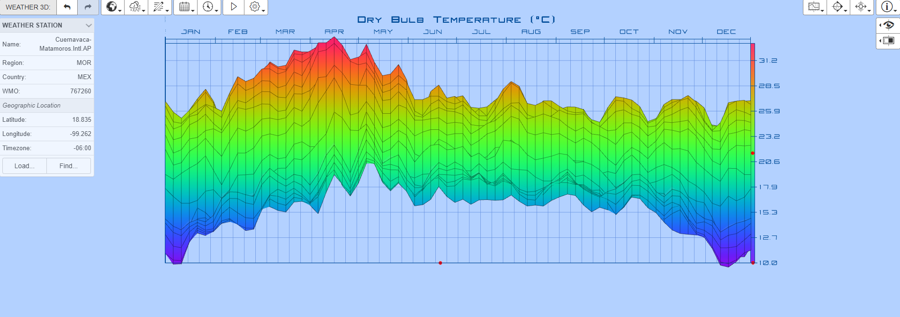
:::
:::

## 12. Climate Consultant: abrir el EPW

::: {.grid-2}
:::{.img-frame}
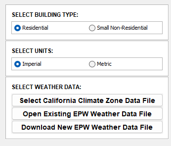
:::

:::{}
Secuencia:

- Seleccionar unidades métricas
- Abrir archivo EPW existente
- Confirmar ubicación
- Pasar a gráficas climáticas
- Descarga: <https://www.sbse.org/resources/climate-consultant>
:::
:::

## 13. Climate Consultant: lectura de temperatura

::: {.grid-2}
:::{}
Preguntas de lectura:

- ¿Qué meses tienen máximos más altos?
- ¿El rango anual es amplio o moderado?
- ¿Qué meses se acercan más a la zona de confort?
- ¿Qué patrón confirma después Python?
:::

:::{.img-frame}
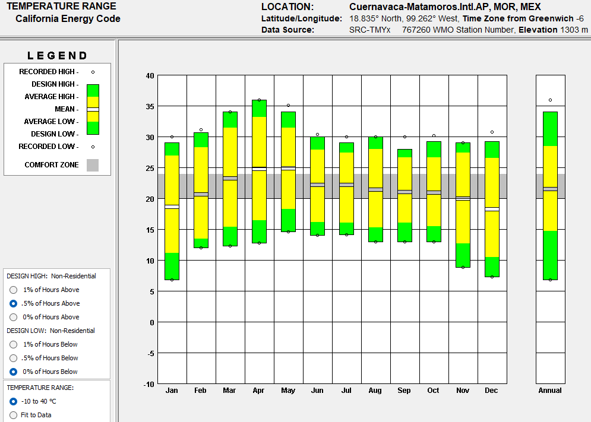
:::
:::

## 14. De la exploración al análisis reproducible

::: {.grid-2}
:::{}
Weather Data y Climate Consultant ayudan a explorar rápido; Jupyter deja el procedimiento documentado:

- Cargar EMA y EPW desde archivos locales
- Limpiar fechas, columnas y unidades
- Reproducir las gráficas del taller
- Calcular máximos, mínimos y promedios
- Guardar resultados para la entrega
:::

:::{.tile}
**Idea central**

La libreta conecta la lectura visual con resultados reproducibles: cada gráfica debe poder explicarse con una celda, un dato y una interpretación breve.
:::
:::
## 15. Python/Jupyter: leer el CSV de EMA

::: {.grid-2}
```python
from pathlib import Path
import pandas as pd
import matplotlib.pyplot as plt

ROOT = Path.cwd()
EMA_CSV = ROOT / "data" / "emas" / "INSTITUTO_MEXICANO_DE_TECNOLOG__A_DEL_AGUA_90_dias.csv"

with EMA_CSV.open(encoding="utf-8-sig") as f:
    lines = f.readlines()

header_row = next(
    i for i, line in enumerate(lines)
    if line.startswith('"Fecha Local"')
)

ema = pd.read_csv(EMA_CSV, skiprows=header_row)
ema["Fecha Local"] = pd.to_datetime(ema["Fecha Local"])
ema = ema.sort_values("Fecha Local")
```

:::{}
Qué se explica:

- El CSV trae metadatos antes de la tabla
- Se detecta la fila real del encabezado
- Se convierte la fecha a tipo temporal
- Ya se puede agrupar y graficar
:::
:::

## 16. EMA: temperatura y humedad

::: {.grid-2}
:::{.img-frame}


:::

```python
ema_daily = ema.set_index("Fecha Local").resample("D").agg({
    "Temperatura del Aire (°C)": "mean",
    "Humedad relativa (%)": "mean",
    "Radiación Solar (W/m²)": lambda x: x.sum() / 6 / 1000
})

fig = px.line(
    ema_daily.reset_index(),
    x="Fecha Local",
    y=["Temperatura del Aire (°C)", "Humedad relativa (%)"],
    title="EMA IMTA: temperatura y humedad diaria",
    labels={"value": "°C / %", "variable": "Variable"}
)

fig.show()
```
:::

## 17. Python/Jupyter: leer el EPW

::: {.grid-2}
```python
epw_cols = [
    "year","month","day","hour","minute","data_source",
    "dry_bulb","dew_point","rh","pressure",
    "extr_horiz_rad","extr_direct_norm_rad","horiz_ir",
    "ghi","dni","dhi",
    "global_horiz_illum","direct_norm_illum",
    "diffuse_horiz_illum","zenith_lum",
    "wind_dir","wind_speed"
]

epw = pd.read_csv(
    EPW,
    skiprows=8,
    header=None,
    names=epw_cols,
    usecols=range(len(epw_cols))
)
epw = epw.drop(columns=["data_source"])
```

:::{}
Lectura:

- El EPW inicia con 8 líneas de metadatos
- Después viene la tabla horaria
- `dry_bulb`, `rh`, `ghi` y `wind_speed` son suficientes para el análisis inicial
:::
:::

## 18. EPW: patrones mensuales y hora-mes

::: {.grid-2}
:::{.img-frame}
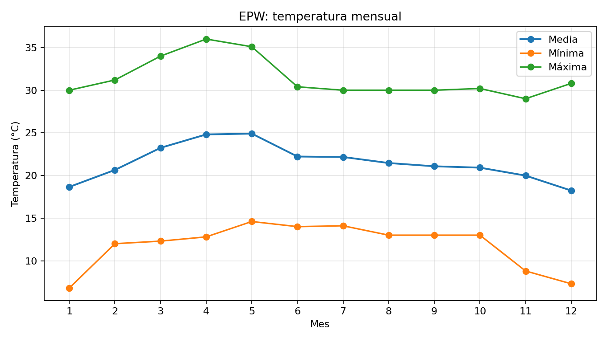
:::

:::{.img-frame}
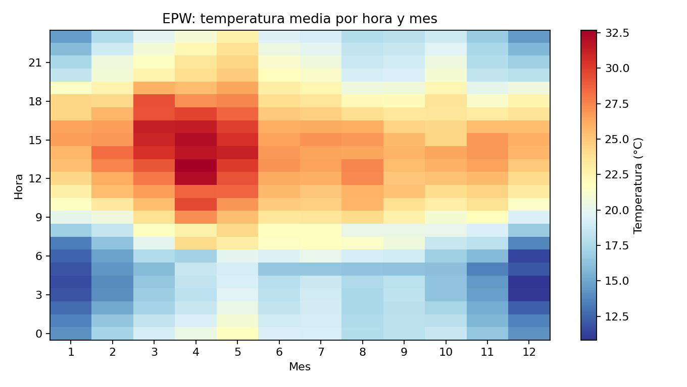
:::
:::

## 19. Actividad guiada

::: {.grid-2}
:::{}
Responder usando **Weather Data**, **Climate Consultant** y **Jupyter**:

1. ¿Cuál es la temperatura máxima del EPW y cuándo ocurre?
2. ¿Cuál fue el día más húmedo en la EMA?
3. ¿Cuál es el mes crítico para temperatura?
4. Genera en Jupyter una gráfica de líneas con la temperatura máxima y la temperatura mínima de cada mes del EPW
:::

:::{.delivery-card}
::: {.delivery-head}
**Entrega individual**
:::

::: {.delivery-body}
Sube tu libreta a la carpeta compartida de Google Drive:

<https://drive.google.com/drive/folders/1BbkIRSkDL8n6BfgtCtWjjbY5zbu4mhVZ?usp=sharing>

Nombre del archivo: `analisis_clima_nombre_apellido.ipynb`
:::

::: {.delivery-check}
Debe incluir: lectura de Weather Data, lectura de Climate Consultant, una gráfica generada en Jupyter e interpretación de 5 a 7 líneas.
:::
:::
:::

## 20. Ejemplo completo: EnerHabitat

::: {.grid-2}
:::{}
Después del análisis climático, el EPW puede alimentar un ejemplo de evaluación térmica:

- Cuatro muros verticales
- Norte, sur, este y oeste
- Temperatura sol-aire media
- Comparación diaria y anual

**EnerHabitat** se presenta como aplicación avanzada desarrollada en el **IER-UNAM**.

Referencias:

- Web app: <https://enerhabitat.unam.mx/>
- Paquete Python: <https://pypi.org/project/enerhabitat/>
:::

:::{.enerhabitat-shots}
:::{.img-frame}
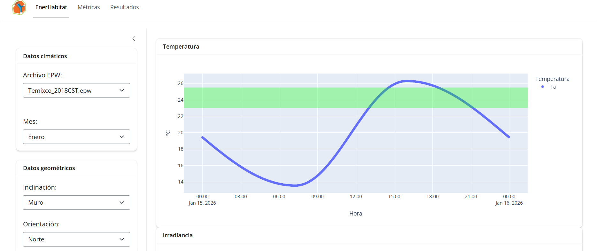
:::

:::{.img-frame}
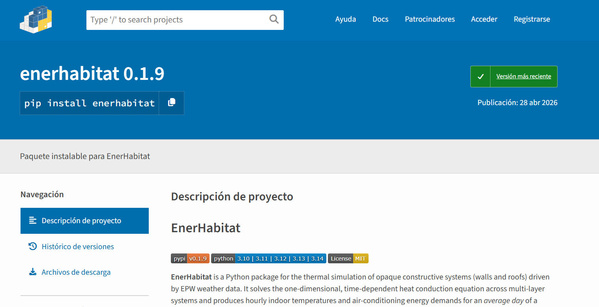
:::
:::
:::

## 21. EnerHabitat: flujo de ejemplo

::: {.grid-2}
```python
from enerhabitat import Location, System, config

config.file = "materials.ini"

location = Location("data/epw/MEX_MOR_...TMYx.epw")

orientaciones = {
    "Norte": 0,
    "Este": 90,
    "Sur": 180,
    "Oeste": 270,
}

for nombre, azimuth in orientaciones.items():
    location.meanDay(day=15, month=5, year=2026)
    muro = System(
        location=location,
        tilt=90,
        azimuth=azimuth,
        absortance=0.65,
        layers=[("Concreto", 0.12), ("Aislamiento", 0.05), ("Yeso", 0.015)],
    )
    tsa = muro.Tsa()
```

:::{}
Qué se muestra:

- El EPW define el clima exterior
- `materials.ini` define propiedades térmicas
- Cada muro cambia por orientación
- Matplotlib resume el comportamiento sin complejidad visual
:::
:::

## 22. EnerHabitat: gráficas generadas

::: {.grid-2}
:::{.img-frame}
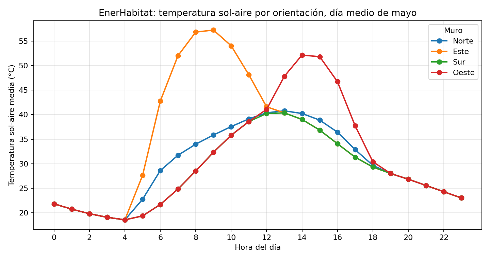
:::

:::{.img-frame}
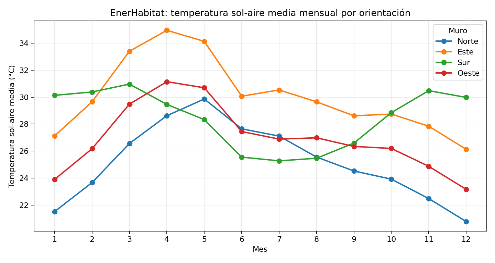
:::
:::

::: {.callout}
Lectura: ¿qué orientación es más crítica en el día medio y cuál se mantiene alta durante el año?
:::

## 23. Agradecimientos

::: {.question}
Gracias.
:::

::: {.grid-2 .thanks-grid}
:::{.thanks-profile}
{.avatar}

::: {.big}
Julio Landa
:::

::: {.muted}
Ciencia de datos y metodología para análisis del clima
:::

Analizar clima es pasar de archivos a interpretación.
:::

:::{.thanks-info}
Contacto:

- Correo: <jclalo@ier.unam.mx>
- Web: <https://juliolanda4.github.io/JulioLanda/>
- LinkedIn: <https://www.linkedin.com/in/juliolanda4/>
:::

:::{.cneer-card}
**CNEER**

Congreso Nacional de Estudiantes de Energías Renovables

- Página: <https://cneer.ier.unam.mx/>
- Convocatoria: <https://drive.google.com/file/d/1RmoJSiMUv2rSjIgBU5YYQP9a2UzNDtQT/view?usp=sharing>
:::
:::